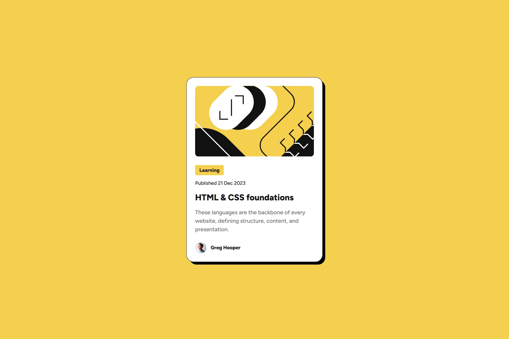

# Frontend Mentor - Blog preview card solution

This is a solution to the [Blog preview card challenge on Frontend Mentor](https://www.frontendmentor.io/challenges/blog-preview-card-ckPaj01IcS). Frontend Mentor challenges help you improve your coding skills by building realistic projects.

## Table of contents

- [Overview](#overview)
  - [The challenge](#the-challenge)
  - [Screenshot](#screenshot)
  - [Links](#links)
- [My process](#my-process)
  - [Built with](#built-with)
  - [What I learned](#what-i-learned)
  - [Useful resources](#useful-resources)
- [Author](#author)

## Overview

### The challenge

Users should be able to:

- See hover and focus states for all interactive elements on the page

### Screenshot



### Links

- Live Site URL: [https://bahauddinmandal.github.io/getting-started-on-frontend-mentor/blog-preview-card/](https://bahauddinmandal.github.io/getting-started-on-frontend-mentor/blog-preview-card/)
- Solution URL: [gitHub](https://github.com/bahauddinmandal/getting-started-on-frontend-mentor/tree/main/blog-preview-card)

## My process

### Built with

- Semantic HTML5 markup
- CSS custom properties
- CSS Grid

### What I learned

## What I Learned 🚀

This project was a great opportunity to reinforce my skills and learn a new technique for responsive design, specifically related to typography.

### Responsive Font Sizing with `clamp()`

The primary takeaway was the effective implementation of the **CSS `clamp()` function** for responsive font sizing. This approach ensures that the font size is adaptive, making the design robust across various viewport sizes.

The `clamp()` function accepts three values:

$$`\text{clamp}(\text{MIN}, \text{PREFFERED}, \text{MAX})`$$

1.  **MIN (Minimum):** The smallest size the font will ever be.
2.  **PREFFERED (Preferred):** The fluid size, often calculated using viewport units (e.g., `vw`), that scales with the screen size.
3.  **MAX (Maximum):** The largest size the font will ever be.

#### Calculation & Implementation:

To determine the preferred value, I used a common formula to calculate the scaling value (the rate at which the font size should change):

$$`\text{Rate} = \frac{(\text{MAX size} - \text{MIN size})}{(\text{MAX viewport width} - \text{MIN viewport width})}`$$

Using this rate, the final preferred value for the `clamp()` function is calculated as:

$$`\text{PREFFERED} = (\text{Rate} \times 100\text{vw}) + \text{Remaining (rem or px)}`$$

**Example:**

For a `--text-1` that should scale from `20px` to `24px` across a viewport range, the CSS looked like this (after calculation):

```css
--text-1: clamp(20px, 0.616vw + 17.69px, 24px);
--text-2: clamp(14px, 0.188vw + 13.29px, 16px);
--text-3: clamp(12px, 0.1878vw + 11.3px, 14px);
```

### Useful resources

- [MDN Web Docs](https://developer.mozilla.org/en-US/docs/Web/CSS/clamp) - This helped me learning css clamp function.

## Author

- email - [bahauddin.one@gmail.com](mailto:bahauddin.one@gmail.com)
- Frontend Mentor - [@bahauddinmandal](https://www.frontendmentor.io/profile/bahauddinmandal)
- twitter - [@bahauddinmandal](https://x.com/bahauddinmandal)
