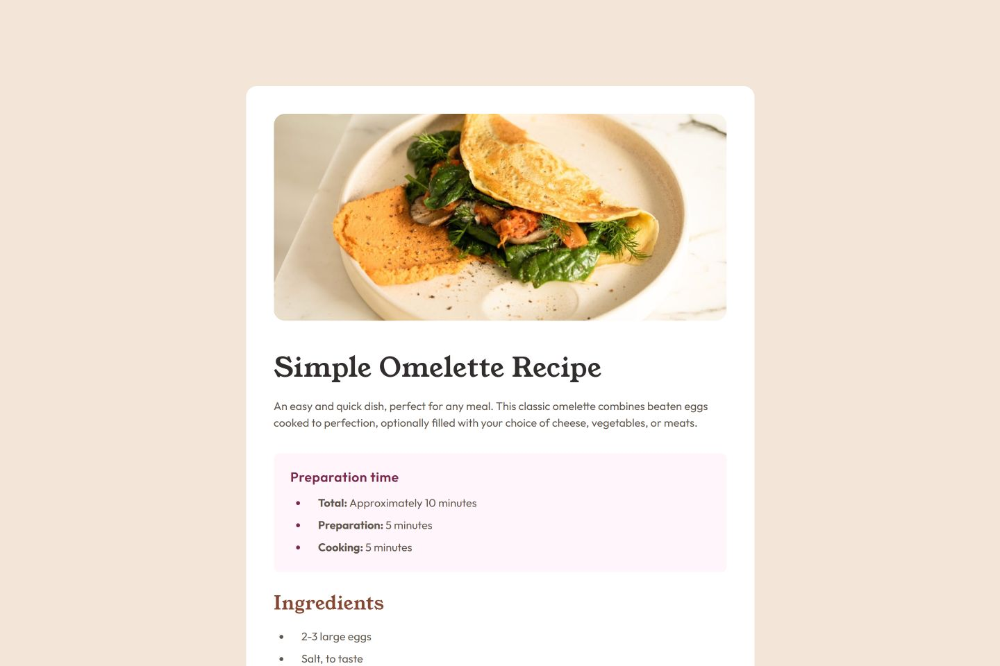

# Frontend Mentor - Recipe page solution

This is a solution to the [Recipe page challenge on Frontend Mentor](https://www.frontendmentor.io/challenges/recipe-page-KiTsR8QQKm). Frontend Mentor challenges help you improve your coding skills by building realistic projects.

## Table of contents

- [Overview](#overview)
  - [The challenge](#the-challenge)
  - [Screenshot](#screenshot)
  - [Links](#links)
- [My process](#my-process)
  - [Built with](#built-with)
  - [What I learned](#what-i-learned)
- [Author](#author)
- [Acknowledgments](#acknowledgments)

## Overview

### The Challenge

The primary goal of this challenge was to accurately build out the provided design for a recipe page, making it look and function perfectly. This involved:

- Creating a **responsive layout** that looks good on any device size, from small mobile screens to large desktops.
- Paying close attention to **design details** such as typography, colors, and spacing to achieve pixel-perfect fidelity with the original image design.
- Structuring the content using appropriate **semantic HTML** to ensure accessibility and maintainability.

### Screenshot

### Links

- Solution URL: [GitHub](https://github.com/bahauddinmandal/getting-started-on-frontend-mentor/tree/main/recipe-page)
- Live Site URL: [https://bahauddinmandal.github.io/getting-started-on-frontend-mentor/recipe-page/](https://bahauddinmandal.github.io/getting-started-on-frontend-mentor/recipe-page/)

## My process

### Built with

- Semantic HTML5 markup
- CSS custom properties
- Mobile-first workflow

### What I learned

## 🚀 What I Learned

During this challenge, I gained valuable practice and deeper understanding in two key areas:

- **Styling Lists:** I learned advanced techniques for styling the **`<ul>`** and **`<li>`** tags, including removing default styles and using custom methods (like pseudo-elements) to create the visually distinct list markers seen on the page.
- **CSS Media Queries:** I utilized **media queries** to ensure the design was fully **responsive** and looked excellent on various screen sizes, from mobile phones to desktop monitors.

## Author

- email - [bahauddin.one@gmail.com](mailto:bahauddin.one@gmail.com)
- Frontend Mentor - [@bahauddinmandal](https://www.frontendmentor.io/profile/bahauddinmandal)
- twitter - [@bahauddinmandal](https://x.com/bahauddinmandal)

## Acknowledgments

A big thank you to **Frontend Mentor** for providing this challenge, the design, and the assets. It offered an excellent opportunity to solidify my skills in CSS layout and responsive design.

The original recipe content was sourced from [Recipe page challenge on Frontend Mentor](https://www.frontendmentor.io/challenges/recipe-page-KiTsR8QQKm).
