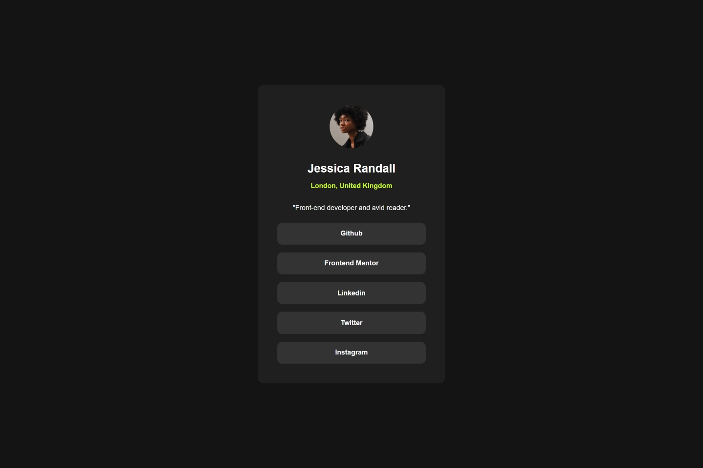

# Frontend Mentor - Social links profile solution

This is a solution to the [Social links profile challenge on Frontend Mentor](https://www.frontendmentor.io/challenges/social-links-profile-UG32l9m6dQ). Frontend Mentor challenges help you improve your coding skills by building realistic projects.

## Table of contents

- [Overview](#overview)
  - [The challenge](#the-challenge)
  - [Screenshot](#screenshot)
  - [Links](#links)
- [My process](#my-process)
  - [Built with](#built-with)
  - [What I learned](#what-i-learned)
  - [Continued development](#continued-development)
  - [Useful resources](#useful-resources)
- [Author](#author)
- [Acknowledgments](#acknowledgments)

**Note: Delete this note and update the table of contents based on what sections you keep.**

## Overview

### The challenge

Users should be able to:

- See hover and focus states for all interactive elements on the page

### Screenshot

### Links

- Solution URL: [GitHub](https://github.com/bahauddinmandal/getting-started-on-frontend-mentor/tree/main/social-link-profile)
- Live Site URL: [https://bahauddinmandal.github.io/getting-started-on-frontend-mentor/social-link-profile/](https://bahauddinmandal.github.io/getting-started-on-frontend-mentor/social-link-profile/)

## My process

### Built with

- Semantic HTML5 markup
- CSS custom properties
- Flexbox

### What I learned

This challenge served as a quick, focused exercise in translating a static design (JPEGs) into a fully functional and styled component, reinforcing the ability to pay close attention to details like font weights, colors, and spacing.

### Continued development

While this challenge is complete, here are the areas I would focus on for further practice and improvement in future projects:

1.  **Accessibility (a11y) Refinements:** I would dedicate more time to ensuring **optimal keyboard navigation** and comprehensive **ARIA attributes** are used, especially for interactive elements like the social links, to guarantee a better experience for screen reader users.

2.  **CSS Variables for Theming:** For a slightly larger project, I would implement **CSS Custom Properties (Variables)** to define colors, fonts, and potentially spacing. This would make it trivial to create a light/dark theme toggle or update the overall style guide rapidly.

3.  **Responsive Text Scaling:** I'd explore more advanced responsive techniques like using **`clamp()`** for font sizes. This would allow the typography to scale more smoothly between different viewport sizes than just using fixed pixel or rem values within media queries.

4.  **BEM Naming Convention:** Although this project is small, I would formally adopt a methodology like the **Block-Element-Modifier (BEM) naming convention** to structure the CSS class names. This improves clarity, modularity, and scalability, making it easier to manage styles as a project grows.

## Author

- email - [bahauddin.one@gmail.com](mailto:bahauddin.one@gmail.com)
- Frontend Mentor - [@bahauddinmandal](https://www.frontendmentor.io/profile/bahauddinmandal)
- twitter - [@bahauddinmandal](https://x.com/bahauddinmandal)

## Acknowledgments

I want to thank the following for their contribution to this challenge:

- **Frontend Mentor:** For providing this excellent challenge, the professional design files, and the style guide. These resources are incredibly helpful for practicing real-world layout implementation.
- **Google Fonts:** For making the **Inter** typeface easily accessible, which was crucial for matching the design specifications precisely.
- **W3C and MDN:** As always, for the invaluable documentation and references used throughout the styling process to ensure best practices for **HTML** and **CSS** implementation.
